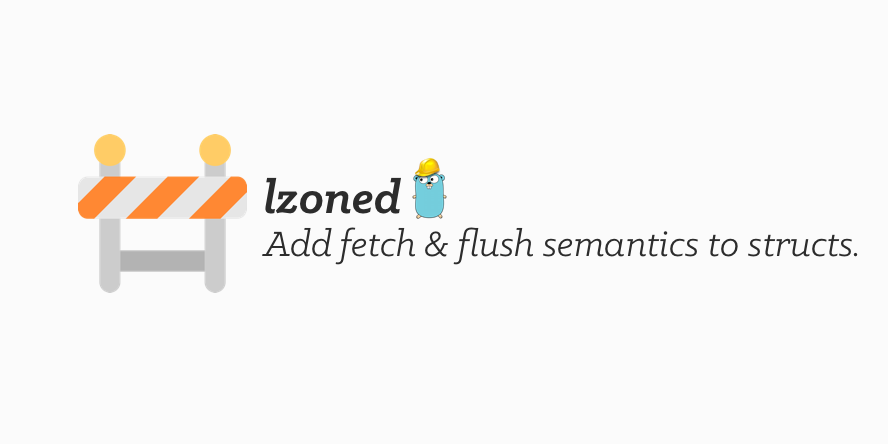
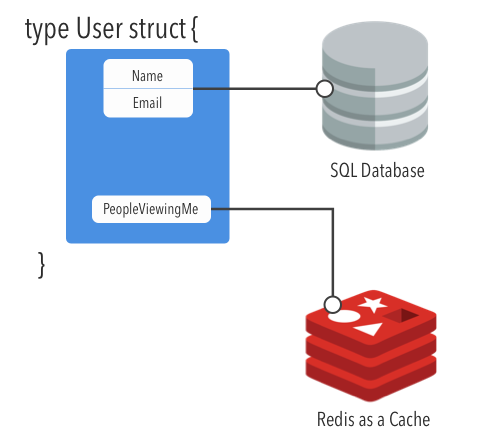

 

[](https://github.com/sotownsend/plumbus/blob/master/LICENSE)

# What is this?

This package provides a way to add fetch & commit (with *N* zones) semantics to your `struct` instances.


### Example scenerio
You have a user model that has a `name` and `email` loaded from a SQL server but their `people_viewing_me` that is computed from another datasource like redis:  

<div style='text-align: center'>
  
</div>

## Example

### Step 1
Let's start with a user object.  We embed the `lz LZoned` structure into our `User` model:

```go
type User struct {
  // SQL Zone
  Name string
  Age int
  
  // Some other data-store (e.g. Redis)
  PeopleViewingMe []People

  lz lzoned.LZoned
}
```

### Step 2
For each `struct` **definition** (**i.e. not instance level, class level**), you will need to create an `LZArena` and add a set of zones.

```go
// Create an LZArena to store our zone operations
var UserArena = NewLZArena()

// Add our zones to the arena
var UserSQLZone = UserArena.AddZone(LZops{
  Fetch: func (obj {}interface) {
    u := obj.(*User)
    SqlQueryToGetNameAndAge(u)
  },
  Commit: func (obj {}interface, tags []string) error {
	u := obj.(*User)

  StartSQLTransaction()
  
  for _, tag := range tags {
   switch tag {
     case 'name':
       UpdateNameViaSQL(u)
     case 'age':
       UpdateAgeViaSQL(u)
   }
  }

  // If commit fails, it will return an error
  err := CommitSQLTransaction()
  return err
})

var UserRedisZone = UserArena.AddZone(LZops{
  Fetch: func (obj {}interface) {
    u := obj.(*User)
    RedisQueryToGetPeopleViewingMe()
  },
  Commit: func (obj {}interface, tags []string) {
	u := obj.(*User)
	Panic("unsupported")
  },
})

func NewUser() *User {
  u := &User{}
  
  //Ensure lz is initiatilized
  u.lz.Init(UserArena, u)
}
```

### Step 3

##### Getters
For your applicable getters on your model, you need to add a `Fetch` before attempting to read from the model.  This `Fetch` call won't do anything if the data was previously fetched but not dirty.

```go
func (u *User) GetName() string {
  // Will only call once if zone is not fetched. Sets state to clean.
  u.lz.Fetch(UserSQLZone)
}
```

##### Setters
For your applicable setters on your model, you need to note that a zone has been dirtied. You can add 'tags' which
will be available in your commit routine so you can update only the fields that have changed.

```go
func (u *User) SetName(name string) string {
  u.lz.SetDirty(UserSQLZone, "name")
  
  u.Name = name
}
```

### Step 4 
Now your ready to call `err := u.lz.Commit()` when you're ready to save all dirty changes. If any of the zones fails to commit (zone commit ops returns error), then this will return the first error and not complete the commit.

## Communication
> ♥ This project is intended to be a safe, welcoming space for collaboration, and contributors are expected to adhere to the [Contributor Covenant](http://contributor-covenant.org) code of conduct.

- If you **found a bug**, open an issue.
- If you **have a feature request**, open an issue.
- If you **want to contribute**, submit a pull request.

---

## FAQ

Todo

### Creator

- [Seo Townsend](http://github.com/sotownsend) ([@seotownsend](https://twitter.com/seotownsend))


## License

lzoned is released under the MIT license. See LICENSE for details.
